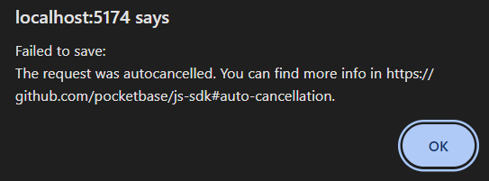

# Fix "Forbidden 403" Error

The error **"Only admins can perform this action"** means your PocketBase collection rules are locked. You need to unlock them to allow your app to read and write data.

## Step 1: Login to PocketBase Dashboard
1.  Go to your dashboard: [http://3.149.240.100/_/](http://3.149.240.100/_/)
2.  Login with your Admin account.

## Step 2: Configure `wards` Collection
1.  Click on the **`wards`** collection in the left sidebar.
2.  Click the **"Settings" (Gear Icon)** or **"API Rules"** tab at the top.
3.  **Unlock the Rules**:
    *   **List/Search**: Click the "Lock" icon to unlock it (set to `Users` or `Public`).
        *   Recommended Rule: `""` (Empty String = Public).
    *   **View**: `""` (Public).
    *   **Create**: `@request.auth.id != ""` (Logged-in users only).
    *   **Update**: `@request.auth.id != ""`
    *   **Delete**: `@request.auth.id != ""`
4.  Click **Save changes**.

## Step 3: Configure `candidates` Collection
1.  Click on the **`candidates`** collection.
2.  Go to **API Rules**.
3.  **Unlock the Rules**:
    *   **List/Search**: `""` (Public).
    *   **View**: `""` (Public).
    *   **Create**: `@request.auth.id != ""` (Logged-in users only).
    *   **Update**: `@request.auth.id != ""`
    *   **Delete**: `@request.auth.id != ""`
4.  Click **Save changes**.

## Step 4: Verify `users` Collection (Optional)
If you are still having login issues, ensure the **`users`** collection allows users to view their own profile.
*   **List/Search**: `id = @request.auth.id` (Users can only see themselves) OR `""` (Public if you want generic user lists).
*   **View**: `id = @request.auth.id` OR `""`.

## Why this is necessary
By default, PocketBase collections are **Private (Admin Only)**. since we switched the app to log in as a regular **User**, the app no longer has "Admin" superpowers. Explicit rules are required to give it permission.
